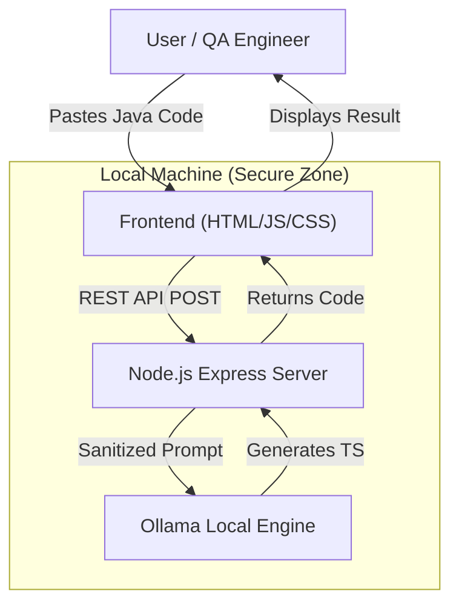

# ⚡ Selenium to Playwright Converter

An AI-powered automation migration tool that transforms legacy Selenium Java (TestNG) code into modern, idiomatic Playwright TypeScript. 

Built with a professional, secure-by-default architecture that ensures all code processing stays on your local machine.

## 🏗 Architecture

The system operates as a local "Command Center" that bridges legacy automation with the modern Playwright ecosystem using a local LLM (Ollama).



## 🚀 Key Features

- **Local-First Security**: No code leaves your machine. Your proprietary test logic is never sent to external clouds.
- **Pure Web Stack**: Built using Node.js, HTML5, and CSS3 for a high-performance, lightweight experience.
- **Smart Context Mapping**: Automatically translates Driver-based logic into Playwright Fixtures (`{ page }`).
- **Web-First Assertions**: Replaces fragile `Thread.sleep` and manual waits with Playwright's auto-waiting mechanism.
- **Automatic Project Scaffolding**: Automatically generates `playwright.config.ts`, `package.json`, and `tsconfig.json` for every conversion.

## 🛠️ Getting Started

### Prerequisites

1.  **Ollama**: Install from [ollama.com](https://ollama.com).
2.  **Model**: Pull the local AI model by running:
    ```bash
    ollama pull llama3.2:3b
    ```
3.  **Node.js**: Ensure you have Node.js (v18+) installed on your system.

### Installation & Run

1.  Clone the repository and navigate into it.
2.  Install the server dependencies:
    ```bash
    npm install
    ```
3.  Start the local command center:
    ```bash
    npm start
    ```
4.  Open your browser to `http://localhost:8081`.

## 📂 Project Structure

- `index.html`: Optimized "Command Center" UI with Monaco Editor integration.
- `server.js`: The central Express.js hub managing AI requests and workspace generation.
- `index.css`: Premium dark-themed UI system.
- `converted_playwright_test/`: Auto-generated workspace for your new tests.

## 📜 License

This project is licensed under the MIT License - see the [LICENSE](LICENSE) file for details.

---
*Developed by Naveen Ravichandran - Specialized AI Testing Project*
