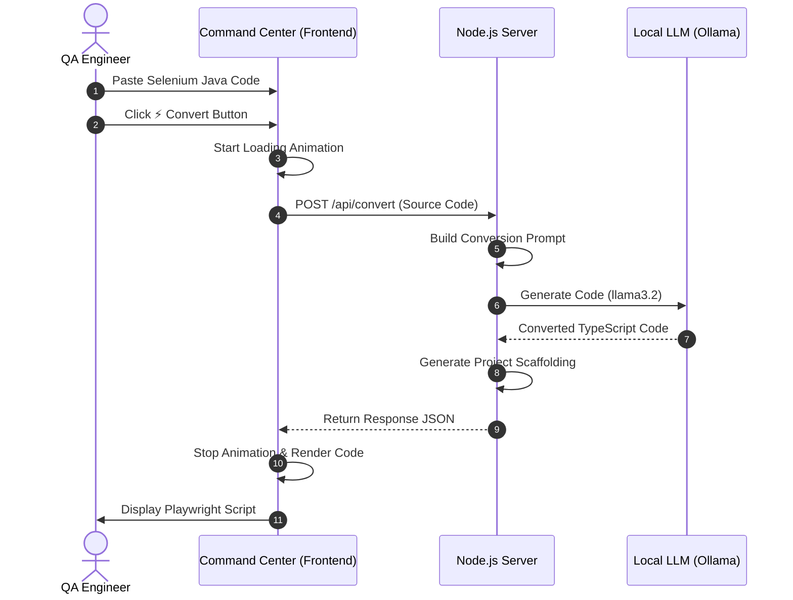
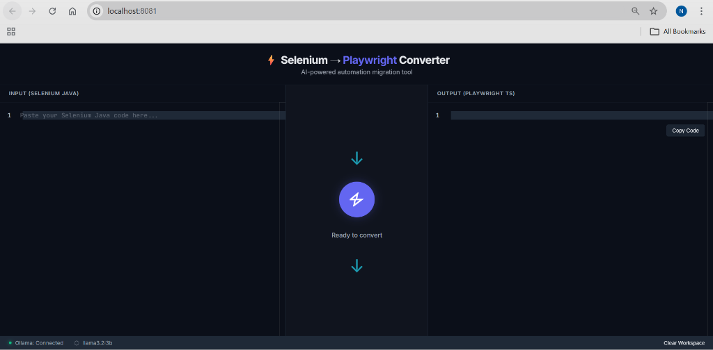
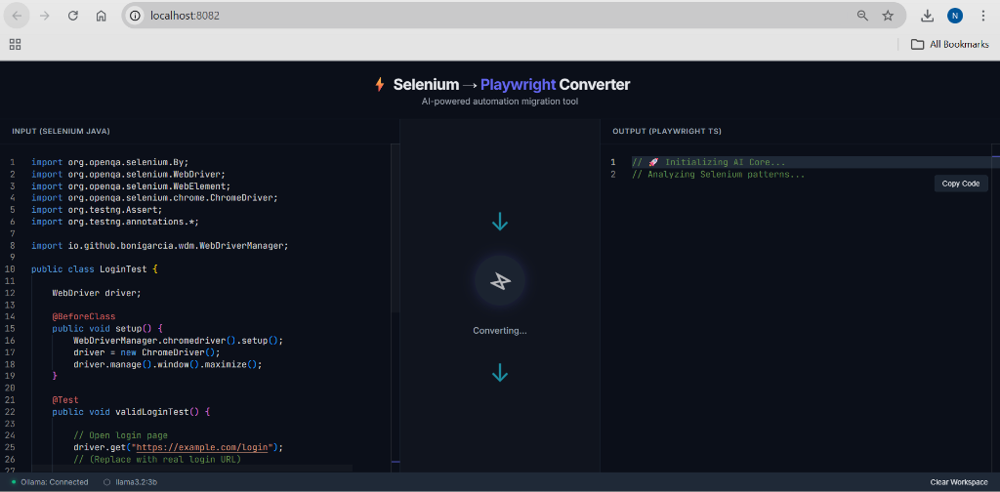
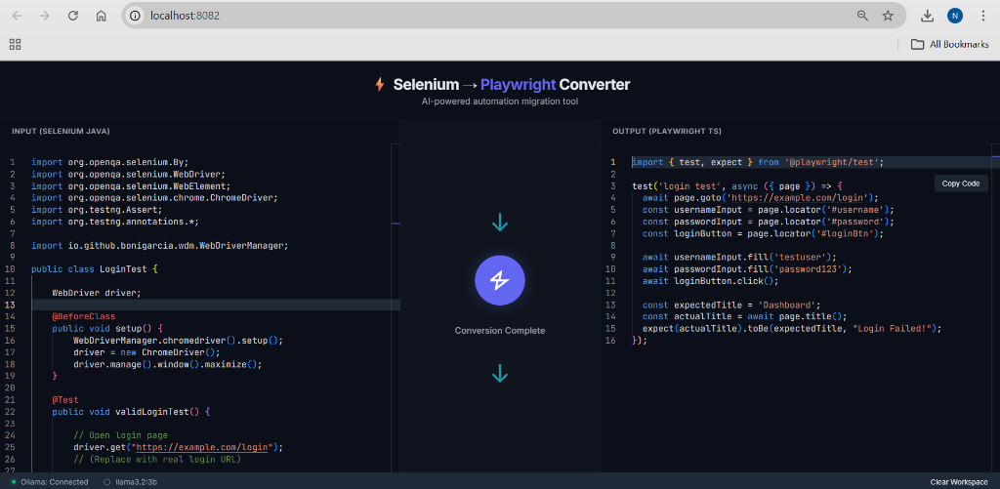

# ⚡ Selenium to Playwright Converter

An AI-powered automation migration tool that transforms legacy Selenium Java (TestNG) code into modern, idiomatic Playwright TypeScript. 

Built with a professional, secure-by-default architecture that ensures all code processing stays on your local machine.

## 🏗 Architecture

The system operates as a local "Command Center" that bridges legacy automation with the modern Playwright ecosystem using a local LLM (Ollama).



## 🚀 Key Features

- **Local-First Security**: No code leaves your machine. Your proprietary test logic is never sent to external clouds.
- **Pure Web Stack**: Built using Node.js, HTML5, and CSS3 for a high-performance, lightweight experience.
- **Smart Context Mapping**: Automatically translates Driver-based logic into Playwright Fixtures (`{ page }`).
- **Web-First Assertions**: Replaces fragile `Thread.sleep` and manual waits with Playwright's auto-waiting mechanism.
- **Automatic Project Scaffolding**: Automatically generates `playwright.config.ts`, `package.json`, and `tsconfig.json` for every conversion.

## 🛠️ Getting Started

### Prerequisites

1.  **Ollama**: Install from [ollama.com](https://ollama.com).
2.  **Model**: Pull the local AI model by running:
    ```bash
    ollama pull llama3.2:3b
    ```
3.  **Node.js**: Ensure you have Node.js (v18+) installed on your system.

### Installation & Run

1.  Clone the repository and navigate into it.
2.  Install the server dependencies:
    ```bash
    npm install
    ```
3.  Start the local command center:
    ```bash
    npm start
    ```
4.  Open your browser to `http://localhost:8082`.

## 📸 Screenshots

<table>
  <tr>
    <th align="center">Ready to Convert</th>
    <th align="center">Converting in Progress</th>
  </tr>
  <tr>
    <td></td>
    <td></td>
  </tr>
  <tr>
    <th align="center" colspan="2">Conversion Complete</th>
  </tr>
  <tr>
    <td colspan="2"></td>
  </tr>
</table>


## 💡 Example Conversion

### Input (Selenium Java + TestNG)
```java
import org.openqa.selenium.By;
import org.openqa.selenium.WebDriver;
import org.openqa.selenium.WebElement;
import org.openqa.selenium.chrome.ChromeDriver;
import org.testng.Assert;
import org.testng.annotations.*;

import io.github.bonigarcia.wdm.WebDriverManager;

public class LoginTest {

    WebDriver driver;

    @BeforeClass
    public void setup() {
        WebDriverManager.chromedriver().setup();
        driver = new ChromeDriver();
        driver.manage().window().maximize();
    }

    @Test
    public void validLoginTest() {
        // Open login page
        driver.get("https://example.com/login");

        // Locate elements
        WebElement username = driver.findElement(By.id("username"));
        WebElement password = driver.findElement(By.id("password"));
        WebElement loginBtn = driver.findElement(By.id("loginBtn"));

        // Perform login
        username.sendKeys("testuser");
        password.sendKeys("password123");
        loginBtn.click();

        // Simple verification: check page title or URL
        String expectedTitle = "Dashboard";
        String actualTitle = driver.getTitle();

        Assert.assertEquals(actualTitle, expectedTitle, "Login Failed!");
    }

    @AfterClass
    public void tearDown() {
        if (driver != null) {
            driver.quit();
        }
    }
}
```

### Output (Playwright TypeScript)
```typescript
import { test, expect } from '@playwright/test';

test('login test', async ({ page }) => {
  await page.goto('https://example.com/login');
  const usernameInput = page.locator('#username');
  const passwordInput = page.locator('#password');
  const loginButton = page.locator('#loginBtn');

  await usernameInput.fill('testuser');
  await passwordInput.fill('password123');
  await loginButton.click();

  const expectedTitle = 'Dashboard';
  const actualTitle = await page.title();
  expect(actualTitle, "Login Failed!").toBe(expectedTitle);
});
```


## 📂 Project Structure

- `index.html`: Optimized "Command Center" UI with Monaco Editor integration.
- `server.js`: The central Express.js hub managing AI requests and workspace generation.
- `index.css`: Premium dark-themed UI system.
- `converted_playwright_test/`: Auto-generated workspace for your new tests.

## 📜 License

This project is licensed under the MIT License - see the [LICENSE](LICENSE) file for details.

---
*Developed by Naveen Ravichandran - Specialized AI Testing Project*
