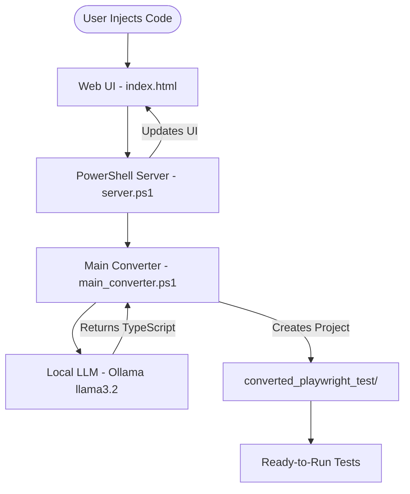

# ⚡ Selenium to Playwright Converter

An AI-powered automation migration tool that transforms legacy Selenium Java (TestNG) code into modern, idiomatic Playwright TypeScript.

## 🏗 Architecture

The system operates as a local "Command Center" that bridges your legacy Selenium code with Playwright using a local LLM through Ollama.

## 🚀 Features

- **Local-First**: No code leaves your machine. Everything runs locally via Ollama.
- **Smart Mapping**: Automatically converts Driver-based logic to Playwright fixtures (`{ page }`).
- **Auto-Wait**: Replaces fragile `Thread.sleep` or manual waits with Playwright's web-first assertions.
- **Project Generator**: Automatically creates a structured Playwright environment (`playwright.config.ts`, `package.json`).

## 🛠️ Getting Started

### Prerequisites

1. **Ollama**: Install from [ollama.com](https://ollama.com).
2. **Model**: Run `ollama pull llama3.2:3b` in your terminal.
3. **Node.js**: Required to run the converted tests.

### Running the Tool

1. Right-click `launcher.ps1` and select **Run with PowerShell**.
2. Open your browser to `http://localhost:8081`.
3. Paste your Selenium Java code in the left panel.
4. Click the ⚡ bolt button.
5. Watch your Playwright code appear in the right panel!

## 📂 Project Structure

- `index.html`: Modern "Command Center" UI.
- `tools/server.ps1`: Lightweight HTTP server handling UI requests.
- `tools/main_converter.ps1`: The AI engine that orchestrates the conversion.
- `converted_playwright_test/`: The output folder where your new tests are generated.

---
*Created by Naveen Ravichandran - AI Testing Project*
