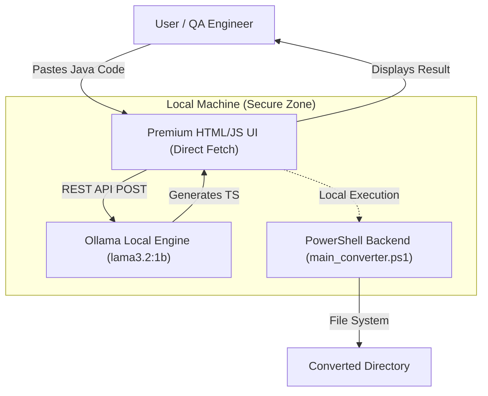

# System Architecture

## Logic Flow
1. **Source of Truth:** User input via the glassmorphism UI.
2. **Analysis:** Browser-side JS sanitizes the input and sends it to the local Ollama instance (`localhost:11434`).
3. **Reasoning:** Ollama processes the Selenium-to-Playwright prompt.
4. **Local Persistence:** For full project conversion, the PowerShell script creates the actual file structure.
5. **Payload:** Reusable Playwright TypeScript tests.
