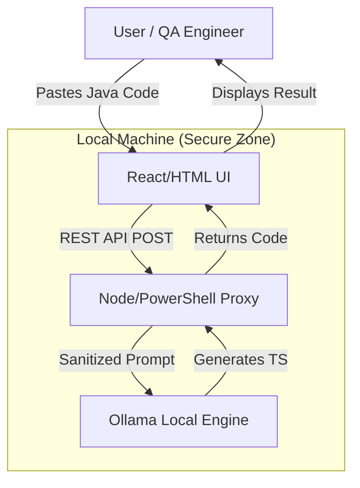

# Gemini - Project Constitution

## 📜 Behavioral Rules
- Priority: Code reliability and deterministic mappings.
- Output: Clean, idiomatic Playwright (JS/TS) code.
- No guessing: If a Selenium pattern is unknown, flag it for manual review or secondary research.

## 🏗️ Architectural Invariants
- Use the 3-Layer Architecture (Architecture/Navigation/Tools).
- All intermediate data resides in `.tmp/`.
- `gemini.md` is the source of truth for schemas.

### System Diagram


## 🔍 Discovery Answers
- **North Star:** UI-based Selenium Java to Playwright (JS/TS) converter.
- **Integrations:** TestNG (Selenium Java) to Playwright (JS/TS).
- **Source of Truth:** UI Input (Code editor/Text area).
- **Delivery Payload:** New local directory creation + UI display of converted code.
- **Behavioral Rules:** Comprehensive conversion; prioritize readability over 1:1 mapping.

## 📊 Data Schemas
### Input Schema (User Code)
```json
{
  "source_code": "string",
  "source_language": "java",
  "framework": "testng",
  "target_language": "javascript|typescript"
}
```

### Output Schema (Converted Code)
```json
{
  "converted_code": "string",
  "target_path": "string",
  "status": "success|error",
  "logs": ["string"]
}
```

## 🪵 Maintenance Log
- 2026-01-28: Constitution initialized.
